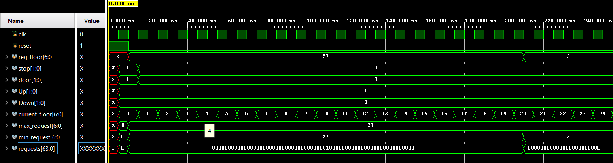
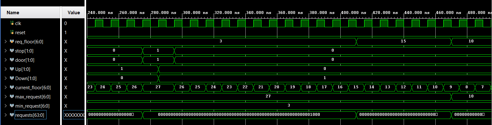
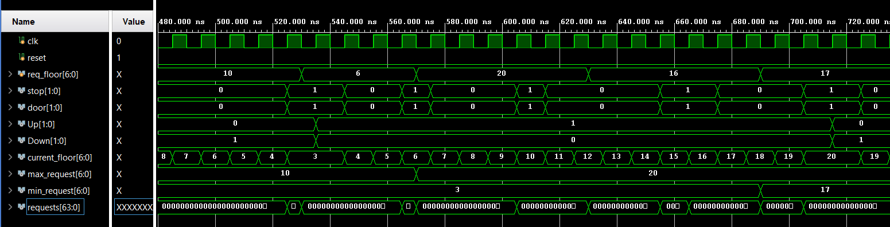
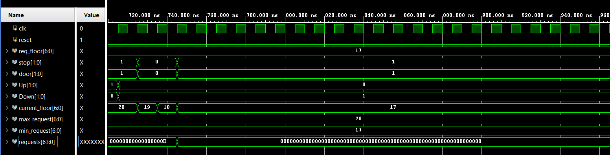

# ES203-Digital-Systems-Project-Elevator-Controller #
With the advent of an era of staggering range of new technologies to provide ease of mobility and transportation elevators have become an essential component of all high rise buildings. An elevator is a type of vertical transportation that moves people between the floors of a high rise building.
Verilog HDL helps in automated analysis and simulation of lift controller circuit. This design is based on synchronous input that operates on a fixed frequency. The Lift motion is controlled by means of accepting the destination floor level as input and generate control signal as output. In the proposed design a Verilog RTL code is developed and verified. 

## Assumptions made ##
* If the lift is serving requests in one direction (either up or down), it doesn’t change its direction before completing requests in that direction.
* The lift stops and becomes idle after serving all the requests at the latest destination floor.
* When the lift reaches the destination floor, the arrival sensors installed generate a control signal to instruct the opening of the lift door.
                

## Variable names and descriptions ##
Name of variable | Parameter values | Description
| :---: | :---: | :---:
CLK  | Time period = 10ns | Periodic signal
reset  | 1-bit binary | Resets the list to initial state
req_floor |  7-bit integer    |   The button pressed by the user, i.e. the floor requested by the user
stop |   1-bit binary    |    Single bit variable. 1 meaning that the lift has stopped on some floor and 0 meaning that the list is in motion
up |    1-bit binary   |    1, meaning that the lift is going in the upward direction
down |   1-bit binary   |    1, meaning that the lift is going in the downward direction
current_floor |  7-bit integer    |    The floor number at which the lift is present at that instant
requests |  64-bit binary    |    Keeps a track of which all requests are pending

   

## Results ##
* A testbench that validates the correctness of the verilog code is also written.  
* The waveforms of all the input signals and the corresponding output signals are also generated.

This project was done in December 2021 as a part of ES203 Digital Systems course at IIT Gandhinagar. It was done in group of two- Ruchit Chudasama (20110172) and Aditi Dey (20110007). 
